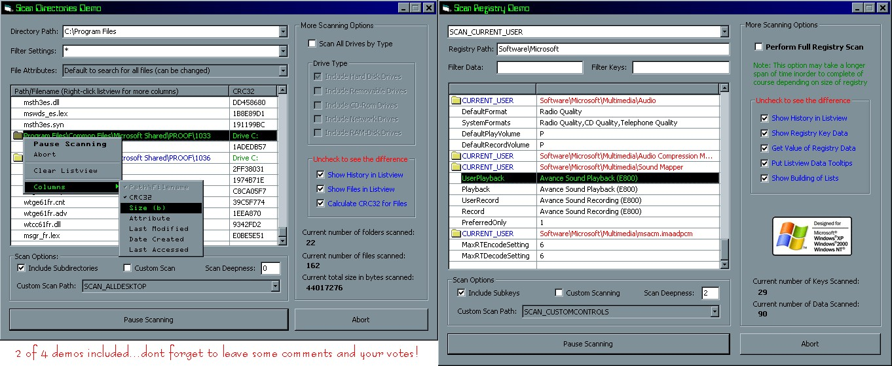

<div align="center">

## VB6 CLASSES FOR SCANNING THE SYSTEM \(UPDATED\)


</div>

### Description

More faster than the previous submission and probably the fastest you will ever encounter having full control over the whole scanning process!

4 vb classes for scanning the registry, files/folders, running processes in the system, and now includes scanning for computers within a network!

The best thing is, you can PAUSE!, RESUME!, how many times you want and ABORT the whole scanning process without any problems at all.

All four classes are fully configurable with extended features and wide stability that I bet you really don't wanna miss.

This would be a good start for making anti-spywares, anti-virus programs, network administration programs, system security, and more.

Included in each of the 4 demos are 3 more classes for advance registry access, crc32 calculation, and getting file icon of files and folders.

AND PLEASE LEAVE SOME COMMENTS REGARDING MY WORK AND DONT FORGET TO VOTE. -noel dacara, a proud Dabawenyo! Pinoy, tangkilikin and sariling atin!
 
### More Info
 
NETWORK CLASS IS STILL UNDER DEVELOPMENT...

I just included it for others to debug and test the class...

SCANPROCESS CLASS will have some noticeable difference when run in Windows9x.


<span>             |<span>
---                |---
**Submitted On**   |2006-02-01 18:25:02
**By**             |[Noel Dacara](https://github.com/Planet-Source-Code/PSCIndex/blob/master/ByAuthor/noel-dacara.md)
**Level**          |Advanced
**User Rating**    |4.9 (68 globes from 14 users)
**Compatibility**  |VB 6\.0
**Category**       |[Libraries](https://github.com/Planet-Source-Code/PSCIndex/blob/master/ByCategory/libraries__1-49.md)
**World**          |[Visual Basic](https://github.com/Planet-Source-Code/PSCIndex/blob/master/ByWorld/visual-basic.md)
**Archive File**   |[VB6\_CLASSE196928212006\.zip](https://github.com/Planet-Source-Code/noel-dacara-vb6-classes-for-scanning-the-system-updated__1-64194/archive/master.zip)

### API Declarations

```
' ==========================================
' PLEASE DONT FORGET TO VOTE!!! -noel dacara
' ==========================================
'
' network class is still under development..
```


